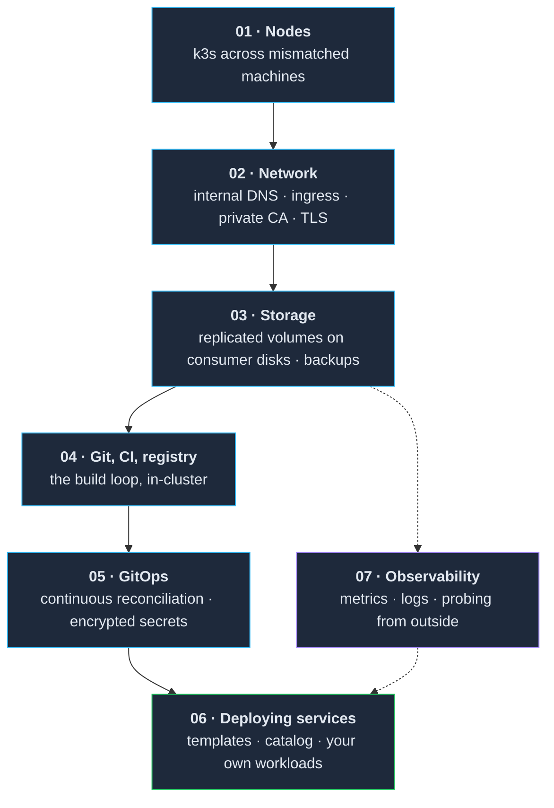
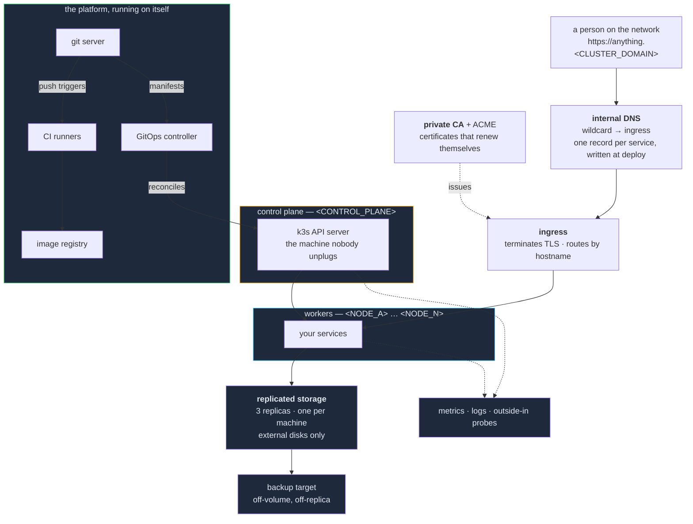

# 00 — The premise

**What you are building, what it will cost you, and the honest case for not doing it.**

Read this before the install path. It is the only section that argues rather than instructs, and
it exists because the expensive mistake here is not a misconfigured node — it is spending three
months building something you did not actually want.

---

## The thing you are building

A **platform**, not a server. The difference is the whole point:

> On a server, you install an application. On a platform, you *declare* that an application
> should exist, and something else makes it true — including making it true again after a reboot,
> a disk failure, or somebody's mistake.

Concretely, when this is finished, adding a service to your network looks like committing a file
and waiting. The name resolves, the certificate is valid, the storage is replicated, the image
was built by your own CI, and nothing about it was typed into a running machine by hand.

Getting there takes seven layers, each of which is useless without the one before it:

**The order is not a preference.** Storage before networking, or GitOps before a registry,
produces failures whose cause is three layers up and whose symptom is somewhere else entirely.
`findings/what-did-not.md` is largely a catalogue of what that feels like.

Observability is drawn off to the side because it is the one layer you can start earlier than
its number suggests, and will wish you had.

## The shape of the finished thing

Note what is **not** in that picture: no cloud account, no external certificate authority, no
public DNS provider, no hosted registry, no vendor. The build loop and the reconciliation loop
both close inside the house. That is a deliberate choice with a real cost — see
[Circularity](#the-circularity-you-cannot-avoid) — and it is the property that makes the whole
thing yours.

Public access, if you want it at all, is a separate and later decision. The design that worked
for us was a small rented machine with a tunnel back in, so that nothing on the home network is
directly exposed and the home address can change without anything breaking. Nothing in layers
01–07 requires it.

---

## What it costs

Four currencies, in the order people underestimate them.

### Attention

**This is the real bill.** A cluster is not a thing you finish; it is a thing you keep. Disks
fill, certificates expire, upstream projects release breaking versions, and a node that has been
fine for four months reboots into a different network configuration than the one you remember
setting.

The honest figure is **a few hours a month once it is stable, and considerably more than that
while it is not** — and "stable" arrives later than you expect, because each of the seven layers
has its own settling period. If you cannot spend attention on it in month five, do not build it
in month one. The failure mode of an abandoned cluster is not that it stops; it is that it keeps
running, quietly wrong, holding data you assumed was backed up.

### Time, up front

Weeks of evenings, not a weekend, if you are learning as you go. The layers are not equally
expensive: nodes and networking go quickly, storage and GitOps do not, and the first time you
debug something three layers below where it appears you will lose a day to it.

You can stop at any layer boundary and have something that works. That is the design of this
repo, and it is worth using — a cluster with nodes, networking and storage is genuinely useful
without CI or GitOps on top of it.

### Hardware

Whatever you already have, plus **disks**. This is the one place where "use what is lying
around" breaks down, for a specific reason: replicated storage means three copies of everything,
on three different machines, and replicas do not belong on the disk the OS is running from.

So the shopping list is not machines. It is one dedicated disk per storage node, external is
fine, plus one larger disk somewhere to hold backups. Consumer USB disks work — the whole point
of the replication is that you have assumed they will fail.

### Electricity

Several machines running continuously, and unlike a single appliance box this is not a rounding
error. Old hardware is not efficient hardware, and the machines you were going to throw away are
usually the least efficient ones you own.

**Measure it rather than trusting a number in a document, including this one** — a plug meter
costs very little and answers the question exactly, for your machines, in your house, at your
electricity price. If you find the answer uncomfortable, that is useful information now rather
than in six months, and the fix is fewer, newer nodes rather than abandoning the project.

---

## The circularity you cannot avoid

Running your own git server means GitOps pulls its manifests from a service that GitOps cannot
deploy — it has to exist before the thing that deploys things exists.

**There is no clever way out of this. There is only a small, honest exception.** A short list of
manifests gets applied by hand, once, on a fresh cluster: the certificate authority, the git
server, the ingress configuration, and the GitOps root. Everything else reconciles.

Plan for it now, because two things follow from it and both are easy to get wrong:

- Those files still live in version control. Only their *application* is manual.
- The list must stay **short and written down by name**. It is the one place where hand-work is
  sanctioned, which makes it the one place hand-work accumulates.

## What you are signing up to never do again

These are the invariants. They are in [`AGENTS.md`](../../AGENTS.md) as instructions to an agent;
here is why they are worth accepting as a human:

- **No fixing things by hand on a running machine.** Every fix is a commit. This is
  uncomfortable exactly once, and then it becomes the reason you can trust what the repository
  says. Every serious incident in `findings/what-did-not.md` that involved working around this
  rule cost more than the shortcut saved — usually days later, in a component that seemed
  unrelated.
- **No unpinned versions.** "Latest", installed across five machines on five different days, is
  not one cluster.
- **No secrets in plain text**, from before the first secret exists — not retrofitted after the
  first leak.
- **No trusting a green status.** The recurring shape of failure on this cluster was a system
  reporting success truthfully about something other than what we cared about.

---

## Do not build this if

Stated plainly, because the alternatives are good and this repo has no interest in recruiting
you:

- **You want the applications, not the platform.** If the goal is a media server and a password
  manager, a single machine running containers with a reverse proxy will serve you better, cost
  a fraction of the attention, and fail in ways you can reason about at midnight. That is not a
  lesser choice; it is the correct choice for that goal.
- **You need it to be reliable for other people.** Home hardware on home power on home internet
  will go down, and the first time it does, everyone who depends on it discovers that you are
  the support desk. Build it for yourself first, and let other people onto it deliberately,
  later, having decided you are willing to be paged.
- **You are hoping to learn Kubernetes quickly.** You will learn it — but the first month is
  mostly networking, DNS, storage and certificates, which is to say Linux. Kubernetes is
  downstream of all of it and is rarely the thing that is broken.
- **The data matters and you will not test restores.** Replication protects against a disk
  dying. It does nothing about a mistake, and it faithfully replicates a deletion to all three
  copies immediately. A backup you have never restored is a hypothesis.

## Build it if

- You want infrastructure practice on hardware whose destruction costs nothing.
- You would rather understand seven layers than operate one appliance.
- You find it genuinely satisfying that a machine somebody was throwing away is now carrying a
  third of your cluster's storage.

That last one is not a joke. It is most of why this cluster exists, and the reason it survived
the months where it was more trouble than it was worth.

---

## Before you start

The next document is the checklist: [`prerequisites.md`](prerequisites.md). Complete it before
`01-nodes/`. It is short, and every item on it is there because skipping it cost somebody a day.
