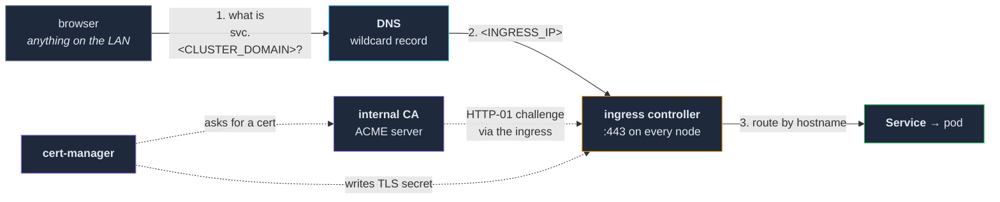

# 02 — Network, DNS and certificates

**Making services reachable by name, over HTTPS, without a manual step per service.**

By the end of this section, deploying a service means creating an ingress rule and nothing else:
the name resolves, the certificate issues, and every machine on the network trusts it. If any part
of that requires you to remember to do something, this layer is not finished — you have just moved
the work to a place where forgetting it is invisible.

**Prerequisite:** `01-nodes/` is complete and gated. Every node `Ready`, rebooted, and consistent.

---

## The four moving parts



Four components, and they must be built in this order, because each one needs the one before it:

| # | Part | Why it comes here |
|---|---|---|
| 1 | **Ingress controller** | Everything else is reached through it, including the certificate challenges. |
| 2 | **DNS** | Names must resolve to the ingress before a certificate can be validated over HTTP. |
| 3 | **Internal CA** | Has to exist before anything can ask it for a certificate. |
| 4 | **cert-manager** | Asks the CA, on a schedule, forever. |

Then a fifth thing that is not a component at all and is the one most often skipped:
**distributing trust** for that CA to every node, every pod and every human.

---

## 1. Ingress — one front door

k3s ships **Traefik** and starts it for you. Use it. A second ingress controller is a second thing
to configure and a second place for a routing rule to be hiding.

Three settings are worth making deliberately, on day one:

- **Redirect HTTP to HTTPS**, globally, at the entrypoint. Not per-service — per-service means one
  service will not have it.
- **Extra entrypoints for anything that is not HTTP.** The ingress opens a fixed set of ports on
  every node, and adding one later is a restart of the ingress controller. If you have any idea
  that mail, or a game server, or a database will need a raw TCP port, add the entrypoint now.
  Non-HTTP routes then use a TCP-mode route with SNI matching rather than an HTTP route.
- **Allow routes to reference secrets across namespaces**, or accept that each service holds its
  own certificate in its own namespace. Either is fine. Deciding by accident is not.

In k3s, Traefik is configured through a `HelmChartConfig` resource, and — like the node config in
`01-nodes/` — **this is a bootstrap file, not a GitOps file.** It has to exist before the thing that
would reconcile it. Keep it in your infrastructure repository, apply it by hand, and write down
that it is one of the handful of files you apply by hand.

**Which IP is the front door?** The ingress listens on every node, so any node's address works.
Pick one, put it in the wildcard DNS record below, and write it down as `<INGRESS_IP>`. It does not
have to be the control plane — and there is an argument that it should not be, so that traffic
load does not land on the machine running the API server.

## 2. DNS — one wildcard, and then never again

**Run a resolver for your own network.** This repo uses AdGuard Home, in the cluster, because it is
also doing ad-blocking for the household and the DNS-rewrite feature is what makes the next
paragraph work. Any resolver that can serve a local zone will do.

**The single decision that makes this layer disappear:**

```
*.<CLUSTER_DOMAIN>   →   <INGRESS_IP>
```

One wildcard record. Every service you ever deploy already resolves. There is no "add a DNS entry"
step in any later procedure in this repo, and that is not because it is automated — it is because
it does not exist.

**Two exceptions that must be explicit A records**, because they point at a *machine* rather than
at the ingress:

- **Each node's own hostname** — `<NODE_A>.<CLUSTER_DOMAIN>` → that node's address. You will use
  these constantly for SSH and for reaching the API server.
- **The API server**, if you give it a name of its own. Point it at the control plane, not at the
  ingress. Add that name to `tls-san` in `01-nodes/` §3 or the certificate will not cover it.

### The chicken and the egg

Your DNS server runs in the cluster; you need DNS to reach the cluster. This is survivable but you
must decide how, before the day it matters:

**Run a second resolver outside the cluster** — most home routers can do this — holding at minimum
the node hostname records and a forward for `*.<CLUSTER_DOMAIN>` to the primary. Hand it out as the
DHCP resolver. Clients then fail over on their own when the node running the primary reboots.

**Write down that the failover is expected**, in your own notes, in these words: *when the node
holding the primary resolver reboots, `<CLUSTER_DOMAIN>` answers go strange for a few minutes and
then come back.* Somebody — probably you, in six months, at speed — will otherwise diagnose that
as a broken router configuration and "fix" a working setup. That has happened here.

> ### ⚠️ The wildcard has a sharp edge, and it is the worst one in this repo
>
> A wildcard record means **every** unresolvable name under your domain returns the ingress
> address instead of failing. Combined with a node whose `/etc/resolv.conf` says `search
> <CLUSTER_DOMAIN>` rather than `domain <CLUSTER_DOMAIN>`, and Kubernetes' default `ndots:5`,
> in-cluster service lookups on that node get the suffix appended, match the wildcard, and
> **silently resolve to the wrong machine**. Not an error — an answer.
>
> This is why `01-nodes/` insists on one network configuration stack across all nodes and on
> looking at `/etc/resolv.conf` yourself. The full write-up is in
> [`findings/what-did-not.md`](../../findings/what-did-not.md) under "One node running a different
> network manager silently corrupted DNS for every pod on it".

## 3. An internal certificate authority

**Why not just accept the browser warnings:** because you will train yourself to click through
them, and because anything that is not a browser — a CLI tool, a container pulling an image, a
service calling another service — does not offer a "proceed anyway" button. It fails, usually with
an error about certificate verification that is three layers below the thing you were doing.

**Why not public certificates for internal names:** they require the names to be publicly
resolvable and validated, which means either exposing things you did not want to expose or running
DNS-01 against a real domain. For a private network, an internal CA is less machinery.

**Run a small ACME-capable CA in the cluster.** This repo uses `step-ca`, which is a single
StatefulSet with one volume, and which speaks ACME — so cert-manager talks to it exactly the way it
would talk to a public issuer. That is the whole reason to prefer an ACME CA over a simpler
self-signed issuer: the mechanism is identical to the one you would use for a public certificate,
so the day you need a public one, nothing new has to be learned.

Like the git server, the CA is a bootstrap component — cert-manager cannot issue the certificate
the CA itself needs, and the deploy machinery cannot deploy the thing its own TLS depends on.

**Set the certificate lifetime deliberately.** Defaults are often short — hours, in some builds.
cert-manager renews at **two-thirds of the lifetime**, so the renewal buffer is one third of it:

| Lifetime | Renewal attempt at | Buffer before expiry |
|---|---|---|
| 24 hours | hour 16 | **8 hours** |
| 30 days | day 20 | **10 days** |

An eight-hour buffer means any cluster hiccup that spans a night becomes a mass expiry across every
service at once. Thirty days means it becomes a thing you notice and fix. This cluster ran the
short default and had exactly that outage.

> ### ⚠️ Where that setting lives is a trap
>
> On `step-ca`, certificate duration is in `ca.json` **inside the CA's data volume** — there is no
> manifest field or environment variable for it. So it is a load-bearing configuration value that
> is *not in git*, does not appear in the manifests you have committed, and **silently reverts to
> the short default if that volume is ever recreated.**
>
> This is the second place in this repo where "everything is in git" is not true (the first is node
> config, in `01-nodes/` §3). The mitigation is the same: keep a copy of the intended value in your
> infrastructure repository with a note saying how to apply it, and add "check the cert duration"
> to whatever procedure you write for restoring the CA.

## 4. cert-manager — one issuer, no manual certificates

Install cert-manager and define **exactly one `ClusterIssuer`**, pointing at your CA's ACME
endpoint. Every certificate in the cluster references that issuer by name. Write the name down;
it appears in every manifest and every template from here on.

**Turn off the ingress controller's own built-in ACME client.** Two things issuing certificates for
the same names is a race with no winner, and it is confusing in exactly the situation where you
need to not be confused.

**Do not issue certificates by hand.** A `Certificate` resource in the same manifest as the service
it belongs to is a one-time thing that renews forever. A certificate somebody created by hand is a
thing that will expire on a date nobody knows.

### Three failure modes, all of which cost us something

**The challenge solver is a bare pod.** HTTP-01 validation spawns a temporary solver pod, which
belongs to no controller and therefore is **never rescheduled**. If it lands on a node that then
dies, it sits there in the API looking alive, the challenge never completes, and the certificate
expires days later in a component nobody connects to the node they removed. See `01-nodes/` §7 —
delete dead nodes properly.

**A default-deny NetworkPolicy blocks the solver too.** If a namespace denies ingress by default,
it denies it to the solver pod as well, and the challenge fails with an HTTP error that names
nothing relevant. The tell is a solver pod that lingers for many minutes. The fix is an explicit
policy allowing ingress to pods labelled as ACME solvers, on the solver's port. Write this policy
into your service template once rather than debugging it per service.

**cert-manager caches DNS answers, and node maintenance can poison that.** After restarting the
agent on a node, cert-manager scheduled there may hold a stale address for the CA's in-cluster
service and fail every order with a connection error that names a *node* address rather than a
cluster one. That specific symptom — a node IP in a cluster-service error — means restart
cert-manager, not investigate the CA.

## 5. Distribute the trust — the step everybody forgets

An internal CA is only useful where its root certificate is trusted. There are **four** places it
has to land, and three of them are easy to forget until something fails obliquely.

| Where | How | What breaks without it |
|---|---|---|
| **Every node's system trust store** | Root cert into the system CA directory, then refresh it | Anything the host itself does over internal HTTPS |
| **Every pod that calls an internal HTTPS endpoint** | Mount the root as a ConfigMap; put it in your service template so it is automatic | `x509: certificate signed by unknown authority`, from inside an application |
| **Every human's browser / OS keychain** | Manually, once per device | Browser warnings, and the habit of clicking through them |
| **The container runtime on every node** | `/etc/rancher/k3s/registries.yaml`, referencing the CA file | `ImagePullBackOff` for every image from your own registry — see `04-git-ci-registry/` |

[`install-ca-trust.sh`](install-ca-trust.sh) does the first of these across all nodes, and prints
what it did. The last one belongs to `04-git-ci-registry/` because the registry does not exist yet,
but the promise made in `01-nodes/` is kept here: **both of these are per-node steps that must be
repeated for every machine you ever add.** Put them in your node onboarding script now, while you
still remember they exist.

> **Verify the cert, not the mount.** A templating system that injects the CA into pods can fail to
> substitute the value and leave a short placeholder string in a file where a PEM should be — the
> volume mounts, the file exists, the path is right, and nothing trusts anything. That happened
> here and went unnoticed across every service deployed for weeks. Check the *contents* on a running
> pod:
>
> ```bash
> kubectl exec -n <NAMESPACE> <POD> -- head -1 /usr/local/share/ca-certificates/<CA_FILE>
> # want: -----BEGIN CERTIFICATE-----
> ```

## 6. Reaching it from outside — optional, and genuinely optional

Nothing in this repo requires public access, and everything works without it. If you do want it:

The pattern that has held here is **a small VPS with a public address, a WireGuard tunnel from one
node to it, and a reverse proxy on the VPS** forwarding named hosts down the tunnel. Nothing is
port-forwarded on the home router; the home network makes one outbound connection and keeps it. It
works behind CGNAT, it survives the home address changing, and the only thing exposed to the
internet is a machine you can rebuild in ten minutes.

**Costs, stated honestly:** a monthly bill for the VPS; every public byte crosses the tunnel, so
throughput is bounded by that VPS's CPU doing encryption rather than by your home connection; and
you now have an internet-facing machine to keep patched. Measure the throughput end-to-end before
you promise anyone a number — the home link speed is a ceiling, not an answer.

Keep public names separate from internal ones. Internal services on `<CLUSTER_DOMAIN>` with the
internal CA; anything public on a real domain with a public certificate. Mixing them is how
something intended to be internal ends up resolvable from outside.

---

## The gate

Do not start `03-storage/` until all of this is true:

- [ ] `*.<CLUSTER_DOMAIN>` resolves to `<INGRESS_IP>` from a client on the network.
- [ ] Node hostnames resolve to the nodes themselves, not to the ingress.
- [ ] A second resolver outside the cluster answers if the primary is down — **tested, by stopping
      the primary**, not assumed.
- [ ] `/etc/resolv.conf` is still consistent on every node after all of this (check again).
- [ ] The CA is running, and its certificate lifetime is set deliberately — not left at the default.
- [ ] Exactly one `ClusterIssuer` exists, and the ingress controller's own ACME is off.
- [ ] A test service issues a certificate end to end, with no manual step.
- [ ] `http://` to that service redirects to `https://`.
- [ ] The CA root is in the system trust store of **every** node.
- [ ] A pod can `curl` an internal HTTPS endpoint without `-k`.
- [ ] Your own machine trusts the CA, and the browser shows no warning.

The failover test is the one people skip here, in the same way the reboot test is skipped in
`01-nodes/`. An untested fallback resolver is not a fallback resolver.
