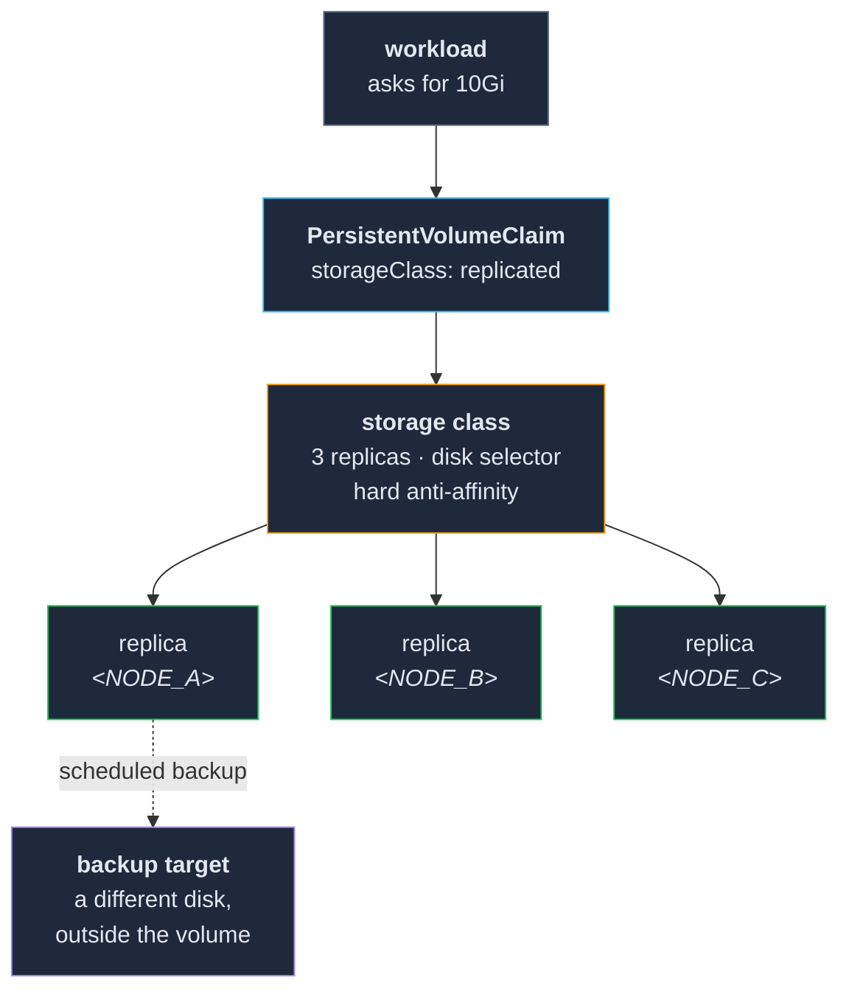

# 03 — Storage

**Volumes that outlive the machine they were running on, and backups that are somewhere else.**

By the end of this section a workload can ask for a volume and get one, that volume survives the
loss of any single node, and its contents are copied somewhere a mistake inside the storage layer
cannot reach. And — the part that is actually hard — you have **proven** the last two by breaking
things on purpose rather than by reading a green dashboard.

**Prerequisite:** `01-nodes/` and `02-network/` are complete and gated. In particular the iSCSI
packages and kernel modules from `01-nodes/` §2 are present on every node, and the dedicated disks
from `00-premise/` item 5 are mounted by UUID at a consistent path.

---

## The shape of this layer



**Three replicas on three different machines, and a backup that is not one of them.** Everything
below is in service of those two sentences actually being true, rather than appearing to be.

---

## 1. Decide whether you need this at all

**You are buying one thing:** the ability to lose a machine without losing the data on it, and
without a restore. Everything else in this section is the price of that.

**The price, stated plainly:**

- **Three times the disk.** Every gigabyte a service stores consumes three.
- **Real CPU and network.** Replication is synchronous — a write is not done until the replicas
  have it. On old hardware this is visible, and it is the reason the storage layer is usually the
  first thing to make a weak node feel slow.
- **A whole component to operate.** Most of §5 of this document exists because this layer has its
  own failure modes, its own scheduler, and its own idea of where things should live.

**If you do not need it**, k3s ships a local-path provisioner that binds a volume to a directory on
one node. It is simple, it is fast, and the data dies with the machine. For a cluster where
everything important is a container that can be recreated and nothing holds state you would miss,
that is a legitimate choice — and skipping this section entirely is better than half-configuring a
replicated store you never verify.

This repo uses **Longhorn**. The specifics below are Longhorn's; the shape is common to any
replicated block store.

## 2. Install it before the things that need it

Storage is a **bootstrap component**, and it comes first among them. The git server in
`04-git-ci-registry/` needs a volume; the certificate authority in `02-network/` needs a volume.
Neither can be deployed by machinery that does not exist yet, and none of them can start without
storage. So: storage, then CA, then git, then everything else — which is exactly the order these
sections are in.

Install it from the vendor's manifests, by hand, once.

> ### ⚠️ Its configuration is not in your git repository
>
> Node and disk configuration for the storage layer lives in **its own custom resources**, edited
> through its UI or API. That is the declarative store — but it is not your repository, nothing
> reconciles it against a file you can review, and a change someone makes in the UI at 11pm leaves
> no diff.
>
> This is the third such admission in this repo (node config in `01-nodes/` §3, cert duration in
> `02-network/` §3). The mitigation is the same and it is not glamorous: **write down the intended
> disk topology** — which disk on which node holds replicas, and which explicitly does not — in
> your infrastructure repository, and treat any divergence you find as a bug in one or the other.

## 3. Tell it which disks it may use — explicitly

**This is the step that goes wrong.** Not dramatically: quietly, and in a way that looks fine for
months.

The failure on this cluster: large external disks were added to hold bulk data, the small internal
system disks were left alone — and "left alone" was not a configuration. One node's *system* disk
had accumulated **50 replicas** while the large disk beside it held three. Nothing was broken.
Everything was in the wrong place, and the OS disk was filling.

Three levers, and you want all three:

| Lever | What it does |
|---|---|
| **Scheduling disabled** on every disk that must not hold data | The blunt, reliable one. An OS disk with scheduling off cannot accumulate anything. |
| **Disk tags** (e.g. `bulk`) on the disks that should | Lets you express intent positively rather than by exclusion. |
| **A disk selector on the storage class** matching that tag | Makes the intent apply to every volume created from then on, without anyone remembering. |

**Do not rely on the default placement being sensible.** It is sensible — it balances across
whatever it is allowed to use. The problem is never the algorithm, it is that nobody told it what
the disks are *for*. Intent that lives only in your head is not configuration.

**If a node has no dedicated disk**, it uses its system disk by necessity, and that is fine as long
as it is a decision. Write down which nodes those are.

## 4. Replica count and anti-affinity

**Three replicas, and hard anti-affinity.** Not soft.

Soft anti-affinity means "prefer different nodes, but place them anyway if you cannot" — which
converts *three copies on three machines* into *three copies on one machine* silently, at the exact
moment your cluster is unhealthy and you most need it not to. That is not redundancy; it is three
chances to lose everything at once.

The consequence: **three replicas requires at least three nodes with schedulable disks**, and if
you want to survive one of them being down for maintenance while still being able to create
volumes, four. This is the real reason `00-premise/` asks you to count the machines with a spare
disk before you start.

Two other settings worth setting deliberately rather than inheriting:

- **Over-provisioning percentage.** How much the storage layer will let you *promise* beyond what
  exists. The honest setting is 100 — it will refuse to schedule what it cannot store. A higher
  number turns "out of disk" from a scheduling refusal into a running-service failure.
- **Minimum available percentage.** Leaves headroom so a disk cannot be filled to the point where
  the storage layer itself cannot operate. Leave it alone unless you have a reason.

## 5. Verify where things actually landed

Everything above is intent. This is measurement, and the gap between the two is the whole content
of §3.

After creating your first volume, and again after adding any disk:

- **Every disk is `Ready` *and* `Schedulable`**, with a plausible capacity. A disk showing zero
  capacity is not a disk in the pool.
- **Replica counts per disk** match your intent — the bulk disks hold the replicas, the system
  disks hold none.
- **No volume is `Degraded`.** Degraded means it has fewer healthy replicas than it wants, and it
  is the state that precedes every bad day in this layer.

**Two things that will look alarming and are records, not disks:**

- **A phantom disk record with an empty path**, left from an add/remove, permanently red with a
  message about failing to stat `""`. Harmless — and harmful anyway, because a permanently red
  thing on a dashboard trains you to ignore red.
- **A filesystem UUID mismatch** after a disk was reformatted, remounted or replaced. The storage
  layer refuses the disk *to protect your data* and reports zero capacity. Correct behaviour,
  alarming presentation.

**Removing a disk record usually requires disabling its scheduling first.** Attempting it in the
other order was rejected here with a server error rather than an explanation. And if a disk comes
back with the *same* mismatch after a remove-and-re-add, the problem is on the host — the mount, or
the storage layer's on-disk config file — and no amount of API work will fix it.

## 6. Backups — the part that was not working for 74 days

**The backup target must not be the cluster.** A separate large disk on one node, exported over
NFS, is the arrangement here: off-volume, off-replica, so a mistake inside the storage layer does
not take the backups with it.

**Its honest limit:** it is still in the same building, on the same power, on the same network. It
protects against deletion, corruption and a disk dying. It does not protect against fire, theft or
flooding. If the data genuinely matters, this is one layer of a plan, not the plan.

### Two traps, both of which cost us

**Creating a backup job enrols nothing.** The schedule existed, the target was reachable, the job
ran green — for **74 days**, backing up zero volumes, because volumes must be enrolled in the job
*individually*. A job that backs up nothing succeeds. It was discovered during an actual data loss.

- **Enrol each volume in the same change that creates it**, never in a cleanup pass.
- Note that the label may need to go on the storage layer's own **volume resource** rather than on
  the PVC — PVC labels are not necessarily propagated. Check which one your version reads, once,
  and write the answer down.
- **Alert on "job completed with zero volumes."** Green is not the signal; *count* is.

**The NFS export must allow the pod network, not just your LAN.** The storage layer mounts the
backup target from inside a pod, so the NFS server sees a source address from the cluster's pod
network — not from `<LAN_SUBNET>`. A normal LAN-only export returns access denied, from a
component that will not tell you why. Both ranges belong in the export:

```
<BACKUP_MOUNT>  <LAN_SUBNET>(rw,...) <POD_CIDR>(rw,...)
```

### Retention is sized against detection, not against frequency

A database here was wiped and **nobody noticed for five days** — the application kept answering and
the pod stayed `Ready`. Retention was seven days, which sounds generous until you subtract five.
The only snapshot left had been taken *after* the data was gone; it restored perfectly and produced
an empty database.

**Size retention against how long a problem can plausibly go unnoticed.** If nothing tells you
within a day that a service is wrong, a seven-day window is really a two-day window. And this is
the argument for `07-observability/` being a real layer rather than a nicety.

### A snapshot is not a backup

A snapshot lives **on the same volume** as the data. It is excellent for "I am about to do something
risky in the next ten minutes" and worthless for "the volume is gone". Backups leave the volume;
snapshots do not. Do not let the word "snapshot" on a dashboard feel like safety.

## 7. Restore once, on purpose

**A backup you have never restored is a hypothesis.**

Do this now, while nothing is wrong and you have no audience: take a service you do not care about,
back it up, destroy its volume, and restore it. Write down what you actually typed. That document —
not the backup job — is the thing you will need at 2am, and the difference between a twenty-minute
recovery and a three-hour one is entirely whether it exists.

This is a checklist item in the gate below, and it is the one this section exists for.

## 8. Operating it without breaking it

**Never attach or detach a Kubernetes-managed volume by hand.** The storage UI offers the button;
the CSI driver owns that lifecycle. Reaching around it left a stale iSCSI target on the node here,
with every subsequent attach failing with "logical unit is still active" and the workload unable to
start at all. Drive it through the workload instead: scale to zero, let CSI detach; scale up, let
CSI attach. **This happened twice** — the second time after it had already been written down.

**A volume that fills up does more than stop accepting writes.** Failed writes set the error flag
in the ext4 superblock, and `resize2fs` then refuses to resize the filesystem — reporting
`Permission denied`, which sends you into RBAC and mount options for an afternoon. The block device
grows; the filesystem does not; the PVC sits in `FileSystemResizePending` emitting hundreds of
failure events. Check `tune2fs -l` for *"clean with errors"* before believing a permissions story,
run `e2fsck -fy` on the unmounted device, then resize. `e2fsck` exit code 1 means "errors
corrected" and is a success here.

**So: alert on volume fullness, not on volume failure.** By the time it has failed, the cheap fix
is already blocked.

**Read-write-once is the only access mode you have**, unless you add something else. Two
consequences:

- Multiple pods can share a volume **only if they are on the same node**. Express that with pod
  affinity on a shared label, so they co-locate wherever the first one lands — never by pinning
  them all to a named machine.
- **A workload pinned to one node with a `nodeSelector`, plus an RWO volume attached elsewhere, is
  a deployment with no pods and no error.** Nothing happens, for days, and nothing says why. Treat
  "deployed, zero pods, zero events" as a volume-attachment question first.

## 9. What this layer owes the monitoring layer

Every alert rule described above needs a metric underneath it, and this is the failure that made
the 74-day backup gap invisible: the monitoring stack **was not scraping the storage layer at
all**. The alert rules existed. They evaluated against no data, and therefore never fired.

`07-observability/` must scrape this component specifically, and the three alerts that matter are:

1. **Volume fullness** — before it fills, not after.
2. **Any volume `Degraded`** — a replica is missing and nobody has looked.
3. **Backup job completed with zero volumes** — the one that would have caught 74 days.

Write those three down now, while you remember why each exists. An alert rule with no metric is not
a safety net; it is the appearance of one.

---

## The gate

Do not start `04-git-ci-registry/` until all of this is true:

- [ ] The storage class exists and a test PVC binds.
- [ ] Every disk in the pool is `Ready` **and** `Schedulable`, with plausible capacity.
- [ ] Scheduling is **explicitly disabled** on every disk that must not hold replicas.
- [ ] Replicas have actually landed on the disks you intended — checked, not assumed.
- [ ] Replica count is 3 with **hard** anti-affinity, and you have at least three nodes able to
      satisfy that.
- [ ] A backup target is configured, it is **not** one of the replica disks, and the export allows
      the pod network as well as the LAN.
- [ ] At least one volume is **enrolled** in the backup schedule, and a backup has completed with a
      volume count greater than zero.
- [ ] **You have restored a volume from a backup, on purpose, and written down how.**
- [ ] Retention is a number you chose against how long a problem could go unnoticed.
- [ ] The intended disk topology is written down in your infrastructure repository.

The restore drill is the one people skip here. Everything above it is a claim; the restore is the
only evidence.
