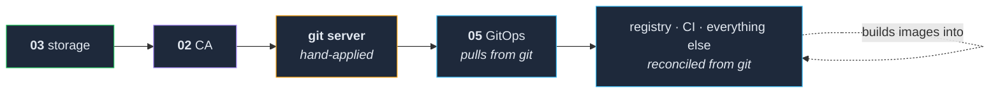

# 04 — Git, CI, and a container registry

**Owning the whole loop: push code, build an image, store it, deploy it — without leaving the
network.**

By the end of this section there is a git server holding your infrastructure repositories, a
registry holding your images, and CI that turns a push into a running container. This is the layer
that makes `05-gitops/` possible at all, because GitOps pulls from a repository and that repository
has to live somewhere.

**Prerequisite:** `03-storage/` is complete and gated. All three components here hold state, and
one of them holds the state everything else is defined in.

---

## 1. Decide whether you want this in-cluster

**The honest alternative is a hosted git provider and its registry.** Both are free at this scale,
neither goes down when you reboot a node, and neither is your problem to upgrade. If your goal is
to run applications, use them, skip most of this section, and point `05-gitops/` at a hosted
repository instead.

**Reasons to host it anyway**, all of which applied here:

- **The loop is local.** Push, build, push image, deploy — with no external account, no rate limit,
  and no dependency on the house's internet connection being up.
- **A pull-through cache for upstream images** (see §4) which stops every node re-pulling the same
  public images and stops you hitting public registry rate limits. This is the most underrated
  component in this section.
- **Understanding the machinery is the point.** If that is why you are building this, owning every
  link is a feature and not a cost.

**What it costs:** you are now the operator of a git server, a registry and a CI system. All three
hold state, all three need backups, and one of them runs database migrations on startup.

This repo uses **Gitea** (git + CI), **Harbor** (registry) and Gitea's own Actions runners. Any
equivalent works — the traps below belong to the shape, not the products.

## 2. The circularity, and how to keep it small



**The git server cannot be deployed by the GitOps that pulls from it.** This was named in
`00-premise/` as the one unavoidable exception, and here is where you pay it.

The answer is not clever, and clever answers here are worse than boring ones: **a short, explicitly
listed set of manifests applied by hand, once.** On this cluster it is five files — the CA, the git
server, the ingress configuration, the GitOps root application, and its ingress route. Each one is
still in version control; only the *application* is manual.

**Three rules that keep this from rotting:**

1. **Write the list down where people look**, with the exact command to apply each file. A
   bootstrap layer nobody can enumerate is just a pile of snowflakes.
2. **Keep it short.** This is the one place manual changes are permitted, so it is the one place
   they will accumulate. Anything that *can* move into GitOps should.
3. **Say out loud that these will not appear in your GitOps dashboard.** Someone will eventually
   wonder why the git server shows as unmanaged. That someone is usually you.

## 3. The git server

Deploy it with a database and a volume, from the bootstrap list. Three things to get right:

- **Back up its volume, and enrol it in the backup job in the same change** — `03-storage/` §6.
  This is the single most important volume in the cluster: it contains the definition of every
  other thing you have built.
- **Back up before major upgrades**, specifically. A git server runs database migrations on
  startup, and "it upgraded and now it will not start" is a much worse afternoon than "I took a
  snapshot first."
- **Decide the organisation/namespace structure now.** Infrastructure repositories under one
  owner, `<ORG>`, keeps the GitOps configuration uniform and means a repository move is not a
  rewrite of every manifest path.

**Repository layout that has held here:** two repositories, deliberately separate.

| Repository | Holds |
|---|---|
| `<ORG>/infra` | Source, Dockerfiles, CI workflows, bootstrap manifests, service definitions |
| `<ORG>/gitops` | Only what GitOps reconciles — the generated and hand-written manifests it applies |

The split is worth it because the second repository is *machine-owned*: things commit to it
automatically, and treating it as the thing GitOps watches — rather than mixing it with source you
edit — keeps "why did this change" answerable.

## 4. The registry — and the promise from `01-nodes/`

Two jobs, and the second one is why you want it even if you never build an image:

1. **Hold the images you build.**
2. **Proxy-cache upstream images.** Configure a pull-through cache for the public registries you
   use and rewrite image references through it. Every node then pulls a public image once,
   from your LAN, and public rate limits stop being a thing that happens to you at the worst
   moment.

### Every node must be told to trust it

**This is the promise made in `01-nodes/` §"Coming back to this layer later" and repeated in
`02-network/` §5.** Without it, every pod pulling one of your own images sits in
`ImagePullBackOff`, and the node onboarding script does not write this file for you.

On every node, `/etc/rancher/k3s/registries.yaml` — a copy is in
[`registries.yaml.example`](registries.yaml.example):

```yaml
mirrors:
  <REGISTRY_HOST>:
    endpoint:
      - "https://<REGISTRY_HOST>"
configs:
  <REGISTRY_HOST>:
    tls:
      ca_file: "/usr/local/share/ca-certificates/<CA_FILE>"
```

Then restart the k3s agent (or server) on that node. The `ca_file` is the certificate
`02-network/`'s `install-ca-trust.sh` put there — **this file is useless without that step, and
that step is incomplete without this file.** Add both to your node onboarding script now. Adding
the sixth machine in six months should not be an archaeology exercise.

> ### ⚠️ Node trust and pod trust are different problems
>
> The file above makes the *container runtime* trust your registry. It does nothing for a **pod**
> that talks to the registry over HTTPS — an image scanner, a mirroring job, any tooling you add
> later.
>
> Here, the vulnerability scanner failed on every one of our own images for weeks with
> `x509: certificate signed by unknown authority`, while its GitOps application reported **Synced
> and Healthy** and its dashboard showed plenty of reports — from the public images it *could*
> read. The component was working. It was just blind to exactly the images we cared about.
>
> Anything deployed outside your service template does not get the CA automatically. When you add
> a tool that reads from the registry, the first question is where its trust store comes from.

### The hairpin

Pushing a very large image from a node, through the LAN, to a registry service running on that same
node was unreliable here — connections reset partway through, repeatably, above a few hundred
megabytes. Small images were fine.

**The fix that worked was to stop making enormous images**: pull large payloads (game assets, model
files, datasets) at runtime into a volume, with an init container, rather than baking them into a
layer. That is better practice regardless, so we never chased the network cause.

## 5. CI

**One workflow per component, triggered by a path filter on that component's directory.** Each
builds its image, pushes it, and triggers its own rollout. Commits that touch documentation do not
rebuild seven images, and the mapping from "directory I edited" to "thing that rebuilds" is obvious
enough that nobody looks it up.

**Where the runners live:** ours run as systemd services directly on a node, not as pods. That
gives them a Docker daemon and a kubeconfig without any in-cluster privilege plumbing, at the cost
of being host-local things you must remember exist. Either choice is defensible; **write down which
one you made and where the runner configuration lives**, because a runner is invisible until it
stops.

**One runner per repository** is worth the small duplication — a stuck job in one repository does
not starve the other.

### Tags, and the only ground truth

Images here are tagged `latest`. That is a real tradeoff:

- Rollback becomes a rebuild rather than a retag.
- **The running pod's image digest is the only ground truth about what is deployed.** Not the CI
  status, not the tag, not the dashboard.

If you would rather have real rollbacks, tag with the commit SHA and have CI update the manifest.
That moves you toward `05-gitops/` doing the deploying, which is the better shape — it is simply
more machinery than we built.

### When every build goes red and nothing is broken

The failure that cost us the most in this layer had nothing to do with our pipelines. **A
server-side regression in the CI server's job-reporting API** meant runners could not deliver a
job's terminal status. The build succeeded, the image was pushed, the deployment rolled — and ten
minutes later a periodic sweeper found a task still marked "running" and marked the run **failed**.

**The signature that identifies this class of problem instantly:** every failure timestamp landing
at the same second-offset, spaced at a fixed interval. That is a periodic reaper, not a build.
Failures caused by your code do not arrive on a schedule.

**And the standing lesson, which generalises well past CI:** a runner that logs nothing after "job
succeeded" is not evidence that it *reported* anything. When two components disagree, look at the
receiving side's logs, not the sending side's silence.

Keep the versions of your CI server and its runners close, and treat a wave of identical failures
across unrelated repositories as a version-pair question before you debug a workflow.

## 6. Credentials appear here — and this is the last section where that is acceptable

CI needs to push to the registry and talk to the cluster. That means real secrets, and right now
your only options are the CI system's own secret store or something checked in.

**Do not check them in.** `05-gitops/` is next and it covers encrypted secrets in git — that is the
answer, it is one section away, and `00-premise/` already told you to have a password manager
before the first secret exists. Use the CI system's secret store for now, and note what you put
there so it can be moved.

---

## The gate

Do not start `05-gitops/` until all of this is true:

- [ ] The git server is reachable over HTTPS at its name, with a certificate from `02-network/`.
- [ ] Its volume is backed up **and enrolled** in the backup job — verified by a non-zero backup.
- [ ] The bootstrap file list is written down, with the command to apply each one.
- [ ] The registry is reachable, and a pull-through cache for upstream images is configured.
- [ ] `/etc/rancher/k3s/registries.yaml` exists on **every** node and references the CA file.
- [ ] A pod successfully pulls an image from your registry on **every** node — not just one.
- [ ] CI builds a trivial change end to end: push → build → image in the registry → pod running it.
- [ ] You have confirmed that deployment by **image digest on the running pod**, not by CI status.
- [ ] The node onboarding script now covers CA trust *and* `registries.yaml`.

The per-node checks are the ones that rot. A registry that works on four nodes out of five is a
cluster where one node silently cannot run half your workloads.
