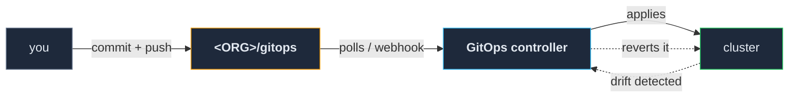

# 05 — GitOps

**The repository becomes the truth, and the cluster follows it.**

By the end of this section, nothing is deployed by a human running a command. A change is a commit;
the cluster converges on it; drift is reverted without anyone noticing. This is the layer that
makes every previous one durable — and it is the layer that will make you angry roughly once a
month, in the moment when the fast fix is a `kubectl edit` and the correct fix is a commit.

**Prerequisite:** `04-git-ci-registry/` is complete and gated. The repository this layer pulls from
has to exist before the thing that pulls from it.

---

## The loop

This repo uses **Argo CD**. Flux does the same job with different vocabulary; everything below
applies to either.

---

## 1. Install it, then hand it the keys

The controller cannot manage itself — it is the thing doing the managing, and an application that
reconciles its own controller can delete its own ability to recover. Install it from the vendor's
manifests, by hand, and treat upgrades the same way.

Then apply **one** more file by hand: the **root application**, pointing at a directory in your
gitops repository. That file is the last thing you ever apply manually. Everything after it is a
commit.

**That makes the bootstrap list from `04-git-ci-registry/` §2 complete** — the CA, the git server,
the ingress configuration, the root application, and its ingress route. Five files. Write them
down, keep the list short, and note that the controller itself is a sixth thing that lives outside
its own management.

## 2. Automated sync, self-heal, and prune — on from day one

Every application, all three settings, from the first one:

| Setting | What it does | Why not "later" |
|---|---|---|
| **automated sync** | Applies what the repo says, without a human pressing anything | A manual sync step is a step someone skips at 1am |
| **self-heal** | Reverts anything changed outside the repo | This is the setting that makes the repo *true* |
| **prune** | Deletes resources removed from the repo | Without it, deleting a file leaves the thing running forever |

**"We'll turn that on once we trust it" is how you end up never turning it on**, because trust
never arrives on its own — it arrives *because* the thing has been reverting your mistakes for
three months.

**What it costs:** you lose the ability to poke at a running system. That tax is real and it is
paid in exactly the moments you least want to pay it. Pay it anyway. Every serious incident in
[`findings/what-did-not.md`](../../findings/what-did-not.md) that begins with someone working "off
the rails" happened in a corner these three settings did not cover.

> ### ⚠️ `Synced + Healthy` does not mean anything is running
>
> An application scaled to `replicas: 0` matches its manifest perfectly and reports **Healthy**.
> Two services here sat scaled to zero — almost certainly a manual edit in some forgotten session
> — and the dashboard was entirely content about it.
>
> **GitOps health answers "does the cluster match the repo".** It does not answer "is anything
> serving requests". Those are different questions needing different instruments, which is
> `07-observability/`'s job and the reason that section exists.

## 3. App-of-apps, and sync waves

**One root application watching a directory of application definitions.** Adding a service becomes
adding a file — no console, no command, no ordering to remember.

**Sync waves** put that ordering in the manifests instead of in someone's head. The shape that
works:

| Wave | What goes here |
|---|---|
| 1 | Certificate machinery, secret decryption — anything everything else needs |
| 2–3 | Registry, DNS, other platform services |
| 5–10 | Monitoring, security tooling, anything with heavy dependencies |
| 20+ | Ordinary services |

**Leave gaps.** Wave numbers are coarse — they express "after", not "when the previous thing is
genuinely ready" — and you will need to insert something between two of them.

A useful timing consequence to know before it confuses you: when the root application creates a
*new* child, that child does not exist until the root reconciles. A newly committed service can sit
apparently doing nothing until the next poll. **Force-sync the root, not the service that does not
exist yet** — the error for the second is "not found", which reads like a failure and is just
timing.

## 4. Secrets, and an honest word about them

This is where `04-git-ci-registry/` §6 said the answer was one section away. Here it is.

**Encrypt secrets and commit them.** A controller in the cluster holds a private key; you encrypt
with the public half; the ciphertext is safe in a public repository and only that cluster can
decrypt it. This repo used **Sealed Secrets**; SOPS with age is the other common answer and is
better if you want the same secrets usable outside Kubernetes.

**Why it matters more than it looks:** it means "everything is in git" has no exception carved out
for the most sensitive category of thing. Exceptions are where leaks live — the secret that is not
in the repo is in someone's shell history, a note file, or a `kubectl create secret` nobody
recorded.

**What it costs, on day one, not later:** **key custody is now your problem.** Lose the
controller's private key and every secret you have ever committed is permanently undecryptable —
including ones you have not created yet. Back that key up to your password manager *before* sealing
the first secret. This is the one prerequisite in this entire repo that cannot be retrofitted,
which is why `00-premise/` puts the password manager before the cluster exists.

**What it does not protect against.** The secret is plaintext inside the cluster. Anyone who can
read secrets in a namespace can read it, and that includes anything running there. Encryption at
rest in git is not access control in the cluster — those are different problems, and this solves
the first one only.

### The disclosure this repo owes you

**The reference cluster did not apply this discipline uniformly.** A number of services carried
plain secret objects in their generated manifests rather than sealed ones.

That was a deliberate call, and the reasoning was specific: **nothing on that cluster was
irreplaceable.** Every credential on it could be regenerated in an afternoon, and none of it
guarded anything that mattered outside the house.

**That reasoning almost certainly does not transfer to you.** If you are reading this, you probably
have at least one real credential — a domain registrar, a cloud account, a backup destination, a
service your family actually depends on — and possibly work of your own you would not want in a
public repository. **Assume you are the case where it matters.** Seal from the first secret; the
cost of doing it from the start is an afternoon, and the cost of retrofitting it is regenerating
every credential you own.

For the CI credentials from `04-git-ci-registry/` §6: seal them now and move them out of the CI
system's own store, or write down that you have not, and where they are.

## 5. Living with it

Six failures from this cluster, all of which share one root cause: **someone applied something to
the cluster directly instead of committing it.** Including us, knowing better, with the rule
already written down.

**An off-rails change does not break the thing you touched.** A test workload created out of band
registered as a real node, died, and surfaced three days later as two expired certificates in a
component nobody would connect to it. That delay is the whole danger: by the time it hurts, the
change that caused it is not in anyone's recent memory.

**Hand-applied workloads become permanently invisible.** Not reconciled, not pruned, not in any
inventory. One sat crash-looping for ten hours, on a different machine than its own documentation
claimed, mounting a volume that had been hand-created and appeared in no manifest.

**If you must do a one-off** — and occasionally you must — write down *at that moment* that it
exists, that it is off the rails, and how it gets cleaned up. Then **put a date on converting it**.
A snowflake with no expiry date is permanent.

**Anything that predates this layer needs an explicit adoption step.** Services deployed before the
tooling existed had no records in it, and its own operations returned "not found" for them — a
diagnostic that reads like a failure and actually means "never known about". Inventory what already
exists, adopt it deliberately, and mark adopted records as adopted so you can tell them apart.

**Migrate, do not duplicate.** A second deploy engine was stood up "in parallel to test it" and
retired without ever taking over. What it left behind was ambiguity: two systems that could each
claim to own a service, and a period where "which one deployed this?" was answered by checking
both.

**Order multi-step operations so the recoverable step comes first.** An eviction here got partway
through — the manifest was marked evicted, the registry agreed, and the service was running
perfectly normally, because the step in between never ran. Every component was internally
consistent and the overall picture was fiction. When reconciling a split state, **trust the
cluster, not the bookkeeping.**

**Exactly one layer owns a given value.** A template's default environment variables and a
per-service override were merged by *appending*, producing duplicate keys in the manifest. The
Deployment could not be applied at all, no pod was ever created, and from outside it looked like a
deploy stuck downloading something. Days went into watching a graph that was never going to move. A
deploy that produces no pod and no error is worse than one that fails.

## 6. Breaking glass

There will be an outage where the correct fix is a direct change. That is fine. What is not fine is
leaving it there:

1. Make the change directly.
2. **Expect self-heal to revert it**, possibly mid-incident. If it must survive, disable sync on
   that one application, explicitly, and set yourself a reminder.
3. **Commit the same change before the incident is closed** — not "later", because later is after
   you have forgotten which of the six things you tried was the one that worked.
4. Re-enable sync and confirm the application goes green *from the repository*.

The measure of this layer is not whether you ever go around it. It is whether going around it is
always temporary and always visible.

---

## The gate

Do not start `06-deploying-services/` until all of this is true:

- [ ] The controller is installed and reachable, and you know it is not self-managed.
- [ ] The root application is applied and creates child applications from a directory in git.
- [ ] Every application has **automated sync, self-heal and prune** enabled.
- [ ] Sync waves are assigned, with gaps, and the ordering has survived one full rebuild-from-empty
      or one deliberate resync.
- [ ] **Self-heal is tested:** change something with `kubectl edit`, watch it revert.
- [ ] **Prune is tested:** delete a manifest from the repo, watch the resource disappear.
- [ ] A secret-encryption controller is running, and **its private key is in your password
      manager** — verified by reading it back, not by remembering that you saved it.
- [ ] At least one real secret is sealed, committed, and successfully decrypted in-cluster.
- [ ] The bootstrap list is written down and complete, including the controller itself.

The two tests in the middle are the ones people skip. An untested self-heal is a belief, and this
whole layer is built on it being a fact.
