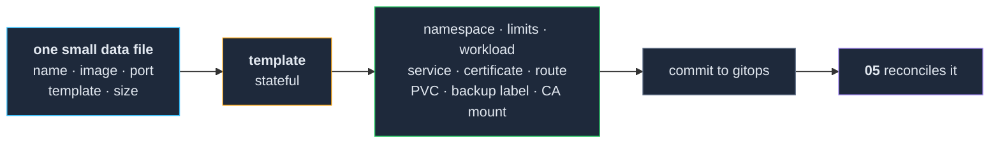

# 06 — Deploying services

**Making "run this thing" a matter of data rather than decisions.**

Everything before this section was platform. This is the first one where you get something a
person in the house actually uses. The goal is narrow and worth stating precisely: **adding a
service should be adding a small amount of data, and every service should get the same set of
objects whether or not anyone remembered them.**

**Prerequisite:** `05-gitops/` is complete and gated. Services are committed, not applied.

---

## 1. What every service needs, whether you remember or not

The thing that makes a cluster navigable a month later is not any individual service. It is that
all of them are shaped the same way.

| Object | Why every service gets one |
|---|---|
| **Namespace** | Isolation, and a unit you can delete. One per service. |
| **Resource requests and limits** | The scheduler bin-packs on requests. `01-nodes/` §5 made this a forever-rule; this is where it is enforced. |
| **The workload** | Deployment, StatefulSet, DaemonSet or CronJob. |
| **Service** | A stable in-cluster address. |
| **Certificate** | From the one `ClusterIssuer` in `02-network/`. Never hand-issued. |
| **Ingress route** | Hostname → service, on the HTTPS entrypoint. |
| **PVC** | For anything stateful, on the storage class from `03-storage/`. |
| **Backup enrolment** | The label or annotation that puts the volume in the backup schedule. |
| **CA trust mount** | So the pod can call other internal HTTPS endpoints. |

**The last two are the ones that get skipped**, and both were promised to you earlier:
`03-storage/` §6 said enrol the volume *in the same change that creates it* — this is that change,
and if it is not a line in the template it does not happen. `02-network/` §5 said pod trust is a
separate problem from node trust — this is where pods get their half.

A worked example carrying all nine is in
[`service-template.yaml.example`](service-template.yaml.example).

## 2. Templates: a small set of real shapes

Six shapes cover almost everything:

| Template | For |
|---|---|
| `stateless` | No persistent storage |
| `stateful` | One volume, no database |
| `stateful-postgres` | App plus its own database, both on volumes |
| `tcp` | Something that is not HTTP — mail, a game server, a database you expose |
| `daemonset` | One pod per node — log shippers, agents |
| `cronjob` | Scheduled work |

Everything past that is a special case, and special cases multiply. Every so often the honest move
is to collapse two templates back into one.

**What this costs, and it is not small:** the templates become a component with their own bugs, and
**a defect in a template is distributed to every service generated from it** — quietly, and all at
once. §4's first trap is exactly that shape.

## 3. Use the simplest machinery that works

You need something that turns *data + template* into *manifests in the gitops repository*. In
rough order of how much you should want it:

1. **A Helm chart of your own with a values file per service.** Off the shelf, well understood,
   and your GitOps controller can render it directly — no generation step and nothing to commit.
2. **Kustomize with a base and per-service overlays.** Same idea, different taste.
3. **A script with `envsubst` or a small templating library**, committing the rendered output.
   Crude, transparent, and completely adequate for twenty services.

This cluster built a small deploy engine with a service catalog — a data file listing every
deployable service, where deploying is naming it and everything else is resolved from the entry.
That was the right shape and the wrong amount of code: **it is a component you now maintain,
upgrade and debug.** Start with option 1 or 3. Build the engine only if you have felt the specific
pain that justifies it.

**The idea worth stealing regardless of mechanism:** the *definition* of a service is data in a
file — image, port, shape, size, ordering — that a human, a script, and later an AI agent can all
read the same way. That is what makes "add a service" a five-line change instead of an exercise in
remembering how the last one was done.

## 4. The traps, all of which cost us something

### Silent substitution failures write nonsense and nothing complains

The deploy tool fetched the internal CA certificate from a secret and substituted it into every
template. Its ServiceAccount had no permission to read that secret, so the API returned `403`, the
fetch returned an **empty string**, and the substitution wrote its fallback text instead.

**Every service deployed by that tool** ended up with a 28-byte file where its CA certificate
should be, containing the literal words *"CA cert not available"*. Nothing failed at deploy time,
nothing failed at startup, and it surfaced only when a service tried to call another internal
service over HTTPS — a slow fault, spread across nine templates.

- **A function that fetches a credential or a certificate must fail loudly.** A fallback string
  written to disk as though it were a certificate is worse than a crash; a crash is found
  immediately.
- **Verify permissions by making the call, not by reading the manifest.** A cross-namespace read
  failing is easy to miss when everything in the tool's own namespace works.
- The API's "what am I allowed to do" field answers for *the account asking*, not for some other
  ServiceAccount. It is not evidence. A `403` from the real endpoint is.

### Exactly one layer may own a value

A template defined default environment variables; a per-service override set some of the same
ones. The merge **appended** instead of replacing, producing duplicate keys in the manifest. The
Deployment could not be applied at all, **no pod was ever created**, and from outside it looked
like a deploy stuck downloading something. Days went into watching a graph that would never move.

Decide which layer owns each value, make the merge deduplicate, and make the failure loud. **A
deploy that produces no pod and no error is worse than one that fails.**

### A naive substitution replaces tokens inside comments too

If your templating is string replacement, a token name written in a **comment** is replaced as
well. With single-line values that just looks odd. With a **multi-line** value — a certificate, for
instance — the replacement breaks out of the comment, and the file becomes invalid YAML that your
GitOps controller cannot apply, with no obvious error.

Keep header comments token-free, or use a templating system with real syntax.

### Things that are not HTTP need a decision you already made

Non-HTTP services need a TCP route and a matching entrypoint on the ingress — and **adding an
entrypoint restarts the ingress controller**, which is why `02-network/` §1 asked you to add them
up front. If mail or a game server is anywhere in your plans, that decision was two sections ago.

### A default-deny NetworkPolicy also denies the certificate challenge

If a namespace denies ingress by default, it denies it to the ACME solver pod too, and the
certificate never issues. Put both allowances — your service's port, and the solver's — in the
template once, rather than rediscovering it per service. Full symptom in `02-network/` §4.

### Read-write-once shapes your templates

Multiple pods can share a volume only on the same node. Express that with **pod affinity on a
shared label** so they co-locate wherever the first one lands — never by pinning them to a named
machine, which converts a scheduling problem into a hard stop. See `03-storage/` §8.

## 5. One namespace per service, named after the service

A simplifying constraint worth adopting: **the namespace, the service name and the hostname are
the same string.** `myapp` → namespace `myapp` → `myapp.<CLUSTER_DOMAIN>`. It removes a whole
category of "which name is this" and makes deleting a service a single, complete operation.

**Its cost, which you should accept knowingly:** there is then no path to deploy a service *into*
an existing namespace — adding something to your monitoring namespace, for example, is a different
operation with a different procedure. Write that second procedure down when you first need it; it
will not fit the first one and pretending it does is how a template grows a special case.

## 6. Choosing what to run

Two rules that have saved more time than any technical practice here:

**Prefer software that is a single container with a volume.** Anything that ships as five
components with an operator is a project, not a service. There is usually a simpler thing that
does eighty percent of the job, and on this hardware the simpler thing is often the only one that
fits.

**Deploy one service, all the way, before deploying five.** All the way means: reachable over
HTTPS, certificate issued automatically, resources requested, volume backed up and *enrolled*,
and its data restored once. That first one is where you find out which line of your template is
wrong — and finding out once beats finding out five times.

---

## The gate

Do not start `07-observability/` until all of this is true:

- [ ] A template exists that generates the full object set in §1 — all nine.
- [ ] A service has been deployed from it end to end, by commit only.
- [ ] It is reachable at `https://<name>.<CLUSTER_DOMAIN>` with a valid certificate.
- [ ] It has resource requests, and you have looked at what the scheduler did with them.
- [ ] Its volume is on your storage class **and enrolled in the backup job** — verified by a
      backup that ran with a non-zero volume count.
- [ ] A pod from that service can reach another internal HTTPS endpoint **without** `-k` —
      proving the CA mount contains an actual certificate.
- [ ] Deleting the service's manifests removes everything it created, with nothing orphaned.
- [ ] The template's own values — which layer owns what — are written down somewhere.

The `-k` check is the one that matters most here. It is the difference between a CA mount that
exists and a CA mount that works, and that distinction went unnoticed on this cluster across every
service for weeks.
