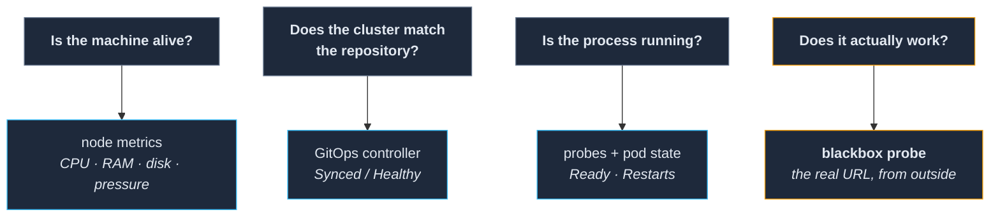

# 07 — Observability

**Knowing whether anything actually works.**

This is the last platform layer, and it is the one that pays back everything in
[`findings/what-did-not.md`](../../findings/what-did-not.md). That file ends on a single sentence
which is also this section's entire thesis:

> **The system reported success, and the report was true but irrelevant.**

The backup job succeeded — with zero volumes. The pod was `Ready` — and served errors to every
request for five days. The application was `Healthy` — at zero replicas. CI was green — and nothing
pulled the image. Every one of those is a **gap between the thing being measured and the thing you
care about**, and closing those gaps deliberately is what this layer is for.

**Prerequisite:** `06-deploying-services/` is complete and gated. You need something running before
watching it means anything.

---

## 1. Four questions, four different instruments

The mistake is thinking of this as one system. It is four questions, and **no instrument answers
more than one of them.**

**Only the fourth one is what a person in the house cares about**, and it is the one most homelab
setups never build. `05-gitops/` already warned you about the second: an application scaled to zero
matches its manifest perfectly and reports `Healthy`.

## 2. What to install

Three components, and they are conventional on purpose — this is not the layer to be inventive in.

| Component | Job |
|---|---|
| **Prometheus + Grafana** (the standard bundle) | Metrics, alert rules, dashboards, and an alert router |
| **A log aggregator with a per-node shipper** | Container output **and host system journals**, centrally searchable |
| **A blackbox prober** | Hits real service URLs from outside and alerts on sustained failure |

**Logs turned out to be worth more than metrics on a cluster this size**, for one specific reason:
**they survive the pod.** Most incidents in this repo were diagnosed by reading the logs of
something that had already restarted — precisely the case a live log tail cannot serve. Ship the
**host journals** too, not just container output: the failures that live below Kubernetes (a
kubelet refusing to start, a disk erroring, a network stack misbehaving) are invisible from inside
it.

**What this costs, and it is the largest cost in the repo after storage:** the monitoring stack is
very often the biggest resident memory consumer on a small cluster. It will be the thing you are
tempted to trim the first time a node is under pressure. Budget for it deliberately, give it
resource requests like everything else, and **set retention low** — you are running an operations
tool, not an archive. Days, not months.

## 3. The alerts that would have caught what actually happened

Not a generic list. Each of these maps to a specific failure in this repo that ran undetected.

| Alert | The failure it would have caught | Promised in |
|---|---|---|
| **Volume above ~80% full** | A full volume corrupted its filesystem and blocked the obvious fix | `03-storage/` §9 |
| **Any volume `Degraded`** | Replicas missing, nobody looking | `03-storage/` §9 |
| **Backup job completed with zero volumes** | **74 days of successful backups of nothing** | `03-storage/` §9 |
| **Certificate expiring within N days** | Two certificates expired from stranded challenge pods | `02-network/` §4 |
| **Blackbox probe failing for 5 minutes** | `1/1 Ready` for five days, 503 on every request | §4 below |
| **Pod restart rate** | A workload with 36 restarts in ten hours, unnoticed | `05-gitops/` §5 |
| **Node `NotReady`** | A dead node holding pod references that looked alive | `01-nodes/` §7 |

> ### ⚠️ An alert rule with no metric underneath it is not a safety net
>
> This is the failure that made the 74-day backup gap invisible, and it is worth understanding
> exactly. **The alert rules existed.** They were syntactically fine and loaded. The monitoring
> stack simply **was not scraping the storage layer at all**, so every one of them evaluated
> against no data — and a rule with no data does not fire, does not error, and does not appear
> anywhere as a problem.
>
> **A rule that has never fired and a rule that cannot fire look identical from a dashboard.**
> When you add an alert, confirm the metric it references actually exists in your metrics store
> first — by querying for it. That is one extra minute per rule and it is the difference between
> monitoring and the appearance of monitoring.

## 4. Probe from the outside, on the path a user takes

**This is the highest-value component in the section and the one to build first if you build only
one thing.**

A service here was `1/1 Ready` for five days while returning an error to every single request. The
liveness probe checked that a process was listening — which it was. The application behind it was
answering everything with a 503 because its database was empty. **Nothing in the cluster noticed.
It was found by a person visiting the site.**

A prober hitting `https://<service>.<CLUSTER_DOMAIN>` and alerting after a few minutes of failure
is a small amount of configuration, and it is the difference between five days and five minutes.

**The known weakness of the version we shipped, stated so you can avoid it:** our target list is
**static**, so a service deployed later is not probed until somebody remembers to add it. *A
monitoring system that depends on you remembering has a half-life.* Generate the target list from
whatever your source of truth for running services is — the same data file `06-deploying-services/`
§3 asked you to keep, or a service discovery rule that picks up every ingress route automatically.
Prefer the automatic one.

## 5. Alerts need a delivery channel, and this is not optional

**An alert that only appears on a dashboard is a dashboard, not an alert.** It requires a human to
already be looking, which is the exact condition under which nothing needs alerting.

Wire up a real channel — email, a push service, a chat webhook, whatever you will actually see —
**at the same time as you write the first rule**, not later. And then **test it by causing a real
alert**, because a misconfigured delivery path fails exactly like a quiet cluster.

We know this one from both sides: alert email delivery on this cluster was broken for a period,
with hundreds of notifications queued behind a name that would not resolve. The alerting was
working perfectly. Nobody was being told.

## 6. Which of your signals are authoritative

Every debugging session goes faster if you know, in advance, which of your screens is allowed to be
believed.

**Authoritative — the cluster's own state:**

- The **running pod's image digest**. This is the only ground truth about what code is deployed —
  not the CI status, not the tag, not a dashboard. `04-git-ci-registry/` §5.
- Pod state, events, and the object as the API reports it.
- The storage layer's own view of replicas and disks.

**Advisory — anything caching a view of the above:**

- **A green CI run.** It proves an image was built. It says nothing about whether anything pulled
  it.
- **`Synced + Healthy`.** It proves the cluster matches the repository. It says nothing about
  whether anything serves requests.
- **Any status field written by a background thread.** An in-house tool here polled deploy jobs to
  completion in a background thread; when its own pod restarted, every in-flight thread died and
  the records froze at whatever they last said. Jobs that had long since succeeded reported
  `committed` forever. **Nothing was broken — but we debugged against the display instead of the
  cluster.**

**If you write a tool with a status surface, make it say which kind it is on its face, and
reconcile in-flight records on startup.** That advice is aimed squarely at `08-the-deploy-engine/`,
which is the tool in question.

## 7. Dashboards last

Build the alerts first. Dashboards are for the moment *after* something tells you to look, and a
beautiful dashboard nobody is watching has caught precisely zero of the incidents in this repo.

Three panels earn their place on a small cluster: **per-node memory pressure** (the constraint on
this hardware), **volume fullness** (the thing that quietly ends), and **blackbox probe status per
service** (the only "does it work" signal you have).

---

## The gate

This is the last section of the install path. Do not consider the platform finished until:

- [ ] Metrics are being collected from every node **and** from the storage layer specifically.
- [ ] Logs from every pod **and** the host journals are searchable in one place.
- [ ] Retention is set deliberately, and the stack has resource requests like anything else.
- [ ] The seven alert rules in §3 exist, and **for each one you have queried its metric and seen
      data** — not just loaded the rule.
- [ ] A blackbox probe covers every service that has a hostname.
- [ ] The probe target list is **generated**, not hand-maintained — or you have written down that
      it is not, and where the list lives.
- [ ] An alert has been delivered to a human, on purpose, as a test.
- [ ] You can state which of your status surfaces are authoritative and which are advisory.

**Then do the one thing that closes the whole install path:** turn a node off. Not gracefully — pull
the power. Watch what happens, note what told you, and note what did not. That is the only test that
covers every layer at once, and this is the moment you can afford to run it.
