# 08 — The deploy engine

**Making a service something you name, not something you build.**

Everything in `00`–`07` is the platform, and it stands on its own. This section is the payoff: a
small service that takes **one line of data and a service name** and does every remaining step —
renders the manifests, commits them to the GitOps repository, registers the DNS name, and records
that the service exists.

It is the reason the earlier sections kept asking for constraints that looked like fussiness.
*One namespace per service, named after the service. Every service gets the same nine objects.
Nothing is applied by hand.* Those are not hygiene. **They are an engine's input contract**, and
this is the engine.

**Prerequisite:** `07-observability/` is complete and gated. Build this last. An engine that
deploys services faster than you can tell whether they work is a machine for generating unknowns.

> **This section ships as source.** The design is here; the working implementation is in
> [`reference-engine/`](reference-engine/) — Apache-2.0, 53 tests, no cluster required to run
> them. Take it, rewrite it, or read it and write your own; all three are fine.

---

## 1. Should you build this at all?

**Probably not yet.** `06-deploying-services/` §3 gave you three options that are less code than
this — a Helm chart with a values file per service, Kustomize overlays, or a script with
`envsubst` — and any of them is adequate for twenty services.

Build an engine when you have felt this specific thing: **you know exactly what deploying a
service involves, you have done it enough times to be bored, and the boredom is where the mistakes
come from.** That is the honest trigger. It is not "this would be elegant."

What you get in exchange is worth naming precisely, because it is not speed:

- **Every service is deployed the same way**, including the parts nobody remembers — the backup
  label, the CA mount, the resource requests.
- **The set of deployed services becomes a data structure** rather than institutional memory. A
  human, a script, and an agent read it the same way.
- **Deploying stops being a procedure you can perform wrong.**

What you pay is a component you now own: it has bugs, it needs upgrades, and — the part people
underestimate — **its bugs are distributed.** §6 is a list of ours.

## 2. The shape

```mermaid
graph TB
    C["<b>catalog entry</b><br/>name · image · port<br/>template · size"] --> E
    T["<b>template</b><br/>the nine objects"] --> E
    E["<b>the engine</b><br/>resolve → render → commit"]
    E --> M["<b>gitops repo</b><br/>apps/NAME/service.yaml<br/>apps/NAME.yaml"]
    E --> D["<b>DNS record</b><br/>NAME.CLUSTER_DOMAIN"]
    E --> L["<b>lifecycle record</b><br/>this service exists"]
    M --> G["<b>05</b> reconciles it into the cluster"]

    style C fill:#1e293b,stroke:#38bdf8,color:#e2e8f0
    style T fill:#1e293b,stroke:#38bdf8,color:#e2e8f0
    style E fill:#1e293b,stroke:#f59e0b,color:#e2e8f0
    style M fill:#1e293b,stroke:#22c55e,color:#e2e8f0
    style D fill:#1e293b,stroke:#64748b,color:#e2e8f0
    style L fill:#1e293b,stroke:#64748b,color:#e2e8f0
    style G fill:#1e293b,stroke:#a78bfa,color:#e2e8f0
```

**Note what the engine does not do: it does not touch the cluster.** It writes files to a git
repository and stops. The GitOps controller from `05` is what changes anything. That boundary is
the single most important design decision here — an engine that applied manifests directly would
be a second source of truth, and `05-gitops/` §5 is an entire section about what that costs.

The engine needs write access to your git repository and nothing else. It does not need cluster
admin. **Give it a token scoped to the GitOps repository and no Kubernetes credentials at all**
if you can — see §6 for what happened to us when we did give it cluster access for one small
convenience.

## 3. The input contract

These are the constraints the earlier sections asked for. Here is what each one buys:

| Constraint | Where it came from | Why the engine needs it |
|---|---|---|
| **name == namespace == hostname** | `06` §5 | One input resolves three values. Without it the catalog entry needs three fields and they can disagree. |
| **Every service gets the same object set** | `06` §1 | The template can be generic. A service that needs a special object needs a special template, which is visible. |
| **Nothing is applied by hand** | `05` §1 | The engine can own the generated files. If humans also edit them, the engine overwrites human work on the next deploy. |
| **One issuer, one storage class, one ingress** | `02`, `03` | Nothing in the catalog entry has to say *which* — there is only one. |
| **Wildcard DNS** | `02` §2 | The DNS step is a formality rather than a per-service record. |

**The last two are why the catalog entry is five lines instead of thirty.** Every "which one"
decision you made once, at the platform layer, is a field the engine does not need.

> ### ⚠️ The engine owns the generated files. Say so in the files.
>
> The manifests the engine writes are **derived artefacts**, and someone will eventually edit one
> by hand to fix something at 1am. It will work, and it will be silently reverted the next time
> that service is deployed.
>
> Put a generated-by header at the top of every file the engine writes, naming the catalog entry
> and template it came from, so the person editing it knows where the real source is. The fix for
> "I need this service to be different" is **a catalog override or a new template** — never an
> edit to the output.

## 4. The catalog

The catalog is one file listing every deployable service. A worked example with three fictional
services is in [`catalog.yaml.example`](catalog.yaml.example).

The required fields are small on purpose:

| Field | Meaning |
|---|---|
| `name` | Unique. Becomes namespace, hostname, and every generated object's name. |
| `image` | Image reference. Rewrite it through your registry's pull-through cache — `04` §4. |
| `port` | The container's HTTP port. |
| `template` | Which shape from `06` §2. |
| `description` | One line. It ends up in the lifecycle record and any dashboard. |

Then a small set of **overrides**, which is where the design pressure actually lands. Ours grew
`storageSize`, `env`, `nodeSelector`, `resourceOverrides`, `securityContext`, `volumes`,
`volumeMounts`, `initContainers`, `configMap` and `secretEnv` — and every one of them was added
because a real service needed it.

**Two rules that keep that list from becoming a second, worse Kubernetes:**

1. **An override replaces; it never merges.** §6's second failure is what merging costs.
2. **An override applies to the main workload only** — the one whose name is the service name.
   A template that ships a database sidecar owns that sidecar's spec entirely. Write this down,
   because it is not guessable, and someone will spend an afternoon wondering why
   `resourceOverrides` did not reach the database.

**When a service needs more than overrides can express, it needs its own template** — a file with
as many objects as it likes, using the same tokens. That is a better outcome than a tenth override
field, because a template is inspectable and an override chain is not.

## 5. Templates: load them from git, not from the image

Ours started with the templates baked into the engine's container image. Every template edit —
a one-line change to a comment — needed an image rebuild and a pod restart, and forgetting either
one produced a deploy that used the *previous* template with no indication it had done so.

**Read the templates and the catalog live from the repository, on each deploy, with a short
cache.** Then:

- A template change ships on `git push`, like everything else in this repo's philosophy.
- **The engine's own image only needs rebuilding when the engine's code changes** — which is the
  correct coupling, and it is a genuinely different cadence.
- The baked-in copies remain as an **offline fallback** for when your git server is down. Keep
  them; the alternative is an engine that cannot deploy anything during a git outage.

The cache has one consequence you must document rather than fix: **for a short window after a push,
a deploy uses the previous template.** Ours is sixty seconds. That is a fine tradeoff, and it is a
confusing five minutes for anyone who does not know about it.

## 6. The failure modes, shipped attached

These are ours. They are in this section rather than in a changelog because **publishing the
engine without them would be the marketing version of it** — every one of these is a shape your
implementation can reproduce.

### A fetch that fails silently poisons every service at once

The engine substituted the internal CA certificate into every template. It read that certificate
from a Kubernetes Secret in another namespace, and its ServiceAccount had no permission to read
there. The API returned `403`, the fetch function returned an **empty string**, and the
substitution wrote its fallback text.

**Every service the engine had ever deployed** carried a 28-byte file where its CA certificate
should be, containing the literal words *"CA cert not available"*. Nothing failed at deploy. It
surfaced weeks later, when one service tried to call another over HTTPS.

> **This is the argument for §2's boundary.** The engine only needed cluster credentials for this
> one convenience — reading a certificate — and that one convenience is what broke every service
> it produced. **Take the certificate from the same repository the templates come from**, and the
> engine needs no cluster access at all.
>
> And regardless: **a function that fetches a credential must raise, never return a default.** A
> fallback string written to disk as though it were a certificate is worse than a crash, because
> a crash is found in the first minute.

### An override that appends instead of replaces produces a manifest that cannot apply

A template defined default environment variables. A catalog entry overrode some of them. The
merge **appended**, producing duplicate keys. The Deployment was rejected by the API server, **no
pod was ever created**, and the deploy looked, from outside, like a service stuck pulling an
image. Days went into watching a graph that was never going to move.

Deduplicate on merge, and **validate the rendered manifest before committing it** — a schema
check, or a dry-run against the API, costs one call and turns this class of bug into an error
message at deploy time.

### Naive token substitution replaces tokens inside comments

If your substitution is string replacement, a token written in a **comment** is replaced too. With
single-line values that is merely odd. Our CA certificate token was **multi-line**: the
replacement broke out of the comment, and the file became invalid YAML that the GitOps controller
could not apply — with no obvious error anywhere.

Use a templating library with real syntax, or keep header comments token-free. `06`'s example
template carries this warning at the top for exactly this reason.

### A status written by a background thread is a lie after a restart

The engine returned a job ID and polled the GitOps controller in a **background thread** until the
application went healthy, advancing the job record through its states.

When the engine's own pod restarted, every in-flight thread died silently and every job record
**froze at whatever it last said**. Deploys that had long since succeeded reported themselves
mid-flight forever. Nothing was broken — but we debugged against the display instead of the
cluster, more than once.

`07-observability/` §6 stated the rule this earns, and it belongs here as a requirement:
**reconcile in-flight records on startup**, by re-reading the actual state, and **label the status
surface as advisory on its face.** The cluster is authoritative. Your job records are a cache of
your opinion about the cluster.

### A lifecycle operation that is not atomic leaves a split state

Our engine can suspend a service — scale it to zero, keep its volume — and later restore it. One
suspension was interrupted partway: the record was flipped to *suspended* and a header comment was
written into the manifest, but the step that actually zeroed the replicas never ran.

The result was a service that **the registry said was suspended and the cluster was happily
serving**, in that state for weeks, and neither the suspend nor the restore command would work on
it any more because each expected the other's state.

**Order every lifecycle operation so the durable record is written last**, and make each step
idempotent so a re-run finishes a half-done operation instead of refusing.

### The deploy that looks stuck is usually the parent app not having reconciled yet

The engine commits two files: the service's manifests, and the child application object that tells
your GitOps controller to watch them. But that child object is only *created* when the **root
app-of-apps** reconciles — on its own polling interval. Until then the deploy sits at "committed",
the child application does not exist, and asking the controller about it returns not-found.

**That is normal timing, not a failure.** If you want to skip the wait, sync **the root
application, not the new one** — the new one does not exist yet, which is the whole point. `05`
§3 promised this note; this is it.

## 7. What the engine deliberately cannot do

Every one of these is a real limitation of ours, and each is better as a documented boundary than
as a tenth special case:

- **Deploy into an existing namespace.** Namespace equals service name, so adding something to
  your monitoring namespace is a different operation with a different procedure. Write that
  procedure separately; it will not fit this one.
- **Deploy a third-party Helm chart.** A chart-based application is a different kind of object
  than a rendered template. Either write a template that embeds what the chart would generate, or
  accept that charts are deployed by hand into the GitOps repository and are not catalog services.
- **Own hand-authored services.** Some workloads are defined by a manifest a human wrote and will
  keep editing. **Those must not be in the catalog** — the engine would overwrite them on the next
  deploy. Keep them in the GitOps repository as ordinary files and be explicit that they are
  outside the rails.

**The rails are for the services that fit the rails.** An engine that grows an escape hatch for
every exception stops being a rail and becomes a second, undocumented Kubernetes.

---

## The gate

This is past the end of the install path, so the gate is about the engine rather than the cluster:

- [ ] A service deploys from a catalog entry alone, with no other file edited by hand.
- [ ] The engine writes to git and **nothing else** — no direct cluster writes, verified by
      taking its cluster credentials away and deploying again.
- [ ] Every generated file carries a header naming its catalog entry and template.
- [ ] A rendered manifest is validated **before** it is committed, and a deliberately broken
      catalog entry fails at deploy time with a readable error.
- [ ] Every fetch of a certificate or credential raises on failure — tested by revoking access
      and confirming the deploy fails rather than succeeding with a placeholder.
- [ ] Restarting the engine mid-deploy leaves no record frozen mid-flight.
- [ ] A suspend interrupted halfway can be re-run to completion.
- [ ] The catalog, the templates, and the generated output are all in git, and you can name which
      repository owns each.

**Then delete a service and deploy it again from its catalog entry.** If what comes back is
identical — same objects, same certificate, same volume enrolled in backups — the engine works.
If anything is missing, that thing was never in the template; it was in someone's memory.
